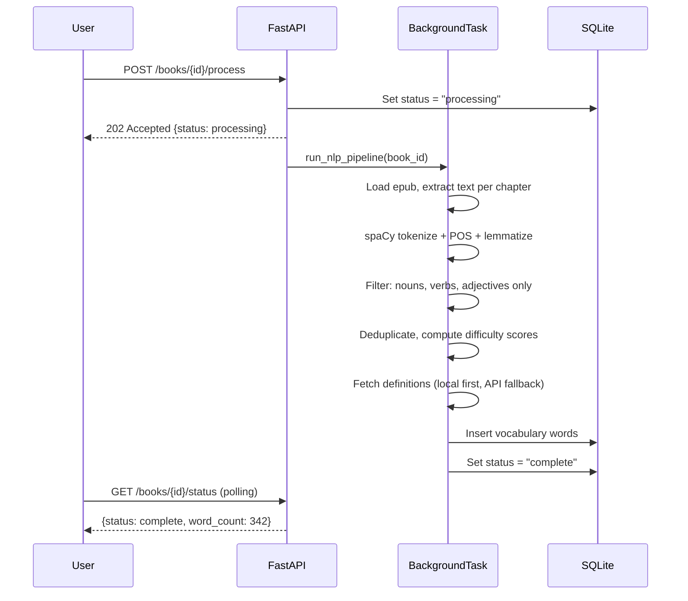
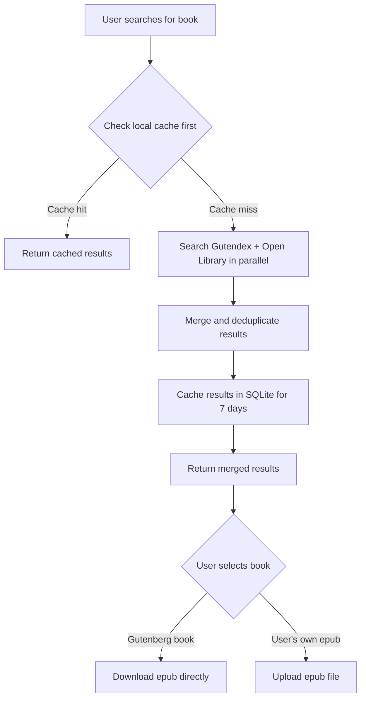
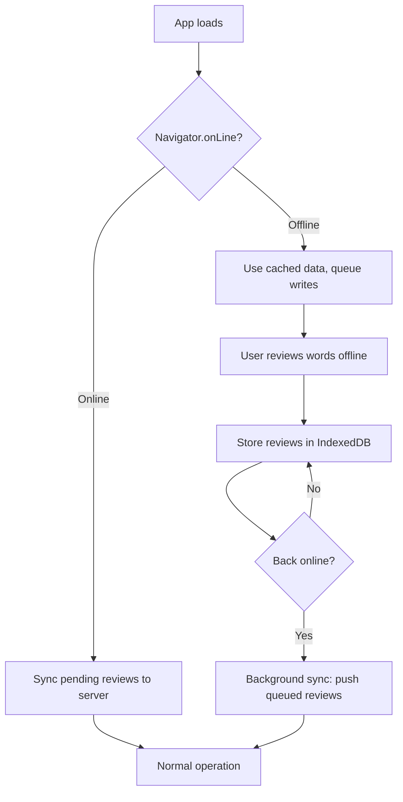

# Technical Architecture: Auto-Vocabulary Feature

> Research date: 2026-04-08
> Stack: FastAPI backend, Next.js 14 frontend, SQLite per-user DBs, Render.com (1GB disk)
> Scale target: 50-100 books/user, 10-20 chapters each

## Executive Summary

This document covers six technical pillars for scaling the auto-vocabulary feature: NLP pipeline design, book catalog/search, word difficulty scoring, definition sourcing, epub processing, and offline-first architecture. The key architectural decision is to use spaCy with disabled components for fast tokenization, FastAPI BackgroundTasks for job processing (no Celery needed at our scale), bundled offline data (wordfreq + WordNet + kaikki.org Wiktionary extract), and SQLite FTS5 for search.

Total additional disk footprint for all bundled data: ~150-200MB (spaCy model + wordfreq + WordNet + dictionary).

---

## 1. NLP Pipeline Design

### 1.1 Tokenizer Benchmarks: spaCy vs Stanza vs NLTK

| Library | Speed (words/sec, CPU) | Model Size | Accuracy | Memory | Best For |
|---------|----------------------|------------|----------|--------|----------|
| **spaCy (en_core_web_sm)** | 8,000-10,000 | 12MB | High | ~200MB | Production NLP, our pick |
| **spaCy (tokenizer only)** | 50,000-100,000+ | 12MB | Tokenization only | ~100MB | If we only need tokens |
| Stanza | 2,000-4,000 | ~100MB+ | Highest (academic) | ~500MB+ | Research, not production |
| NLTK (word_tokenize) | 20,000-40,000 | Minimal | Moderate | ~50MB | Simple tokenization only |

**Recommendation: spaCy `en_core_web_sm`** with selective component disabling.

- For vocabulary extraction we need: tokenization, lemmatization, POS tagging (to filter nouns/verbs/adjectives)
- We do NOT need: NER, dependency parsing, sentence segmentation
- Disabling unused components gives 2-3x speedup

```python
import spacy

# Load with only what we need
nlp = spacy.load("en_core_web_sm", disable=["ner", "parser"])
nlp.max_length = 2_000_000  # Allow book-length texts

# For batch processing, use nlp.pipe()
docs = nlp.pipe(chapter_texts, batch_size=50)
```

### 1.2 Processing Time Estimates for a 300-Page Book

A 300-page book is roughly 75,000-90,000 words.

| Pipeline Config | Est. Time | Notes |
|----------------|-----------|-------|
| Full spaCy pipeline | 8-12 sec | All components enabled |
| **spaCy (disable ner+parser)** | **3-5 sec** | Our recommended config |
| spaCy tokenizer only | <1 sec | No POS/lemma - insufficient |
| Stanza full | 20-45 sec | Too slow for our use case |
| NLTK tokenize + manual | 2-3 sec | Missing lemmatization quality |

At 3-5 seconds per book, this is fast enough for a background task but too slow for a synchronous API response.

### 1.3 Background Job Architecture

**Decision: FastAPI BackgroundTasks** (not Celery, not threading)

| Option | Pros | Cons | Verdict |
|--------|------|------|---------|
| **FastAPI BackgroundTasks** | Zero dependencies, built-in, simple | No retries, no persistence, dies with server | **Use this** |
| Celery | Retries, monitoring, distributed | Needs Redis/RabbitMQ broker, massive overkill | Overkill for single-server |
| Threading (concurrent.futures) | Fine-grained control | Manual state management, GIL issues | Unnecessary complexity |
| asyncio.create_task | Native async | CPU-bound NLP blocks event loop | Wrong tool for CPU work |

Why BackgroundTasks wins for our scale:
- Single server on Render.com, no distributed workers needed
- 50-100 books per user, processed once each - not a continuous stream
- If the server restarts mid-processing, user just re-triggers (acceptable UX)
- No external broker dependency (Redis would cost extra on Render)

```python
from fastapi import BackgroundTasks

@router.post("/books/{book_id}/process")
async def process_book(book_id: str, background_tasks: BackgroundTasks):
    background_tasks.add_task(run_nlp_pipeline, book_id, user_id)
    return {"status": "processing", "book_id": book_id}
```

### 1.4 Processing Pipeline Flow



### 1.5 Chunked Processing for Memory Safety

On Render's 1GB disk / limited RAM, we can't load an entire book into memory at once for very large files. Process chapter-by-chapter:

```python
def process_book_chunked(book_id: str, user_id: str):
    chapters = extract_chapters(epub_path)  # yields (title, text) tuples
    all_words = {}

    for title, text in chapters:
        doc = nlp(text)  # process one chapter at a time
        for token in doc:
            if token.pos_ in ("NOUN", "VERB", "ADJ") and not token.is_stop:
                lemma = token.lemma_.lower()
                if lemma not in all_words:
                    all_words[lemma] = {"pos": token.pos_, "count": 0}
                all_words[lemma]["count"] += 1

    # Batch score and define after dedup
    scored_words = score_difficulty_batch(all_words)
    save_vocabulary(book_id, user_id, scored_words)
```

---

## 2. Book Catalog and Search

### 2.1 API Sources Comparison

| Source | Coverage | Auth | Rate Limits | Data Quality | Epub Access |
|--------|----------|------|-------------|--------------|-------------|
| **Gutendex** | 70,000+ public domain | None | Generous (no stated limit) | Good metadata | Direct download links |
| **Open Library** | 40M+ editions | None (User-Agent header) | 100 req/5min (3x with UA) | Excellent metadata | Borrowing only |
| Google Books API | Largest catalog | API key | 1,000/day free | Best cover images | Preview only |

**Recommendation: Gutendex as primary, Open Library as supplement.**

### 2.2 Gutendex API Details

Base URL: `https://gutendex.com/books`

Key query parameters:
- `search=` - search title and author (space-separated, case-insensitive)
- `languages=en` - filter by language
- `topic=` - filter by subject/bookshelf
- `sort=popular` or `sort=ascending` (by ID)
- `mime_type=application/epub` - filter to books with epub format

Response includes direct download URLs for epub, plain text, HTML formats. No auth needed.

```python
import httpx

async def search_gutenberg(query: str, page: int = 1) -> dict:
    params = {"search": query, "languages": "en", "page": page}
    async with httpx.AsyncClient() as client:
        resp = await client.get("https://gutendex.com/books", params=params)
        return resp.json()
```

### 2.3 Open Library API Details

Endpoints:
- Search: `https://openlibrary.org/search.json?q={query}&limit=20`
- Works: `https://openlibrary.org/works/{id}.json`
- Covers: `https://covers.openlibrary.org/b/id/{cover_id}-M.jpg`

Rate limits: 100 requests per 5 minutes per IP. With User-Agent header: 300 per 5 minutes.

Open Library is better for modern books (ISBNs, cover art, descriptions) but doesn't provide downloadable epubs.

### 2.4 Combined Search Strategy



### 2.5 Local Book Metadata Cache with SQLite FTS5

SQLite FTS5 is the right tool here. It handles our scale (thousands of books, not millions) with sub-millisecond query times and zero external dependencies.

```sql
-- Book metadata table
CREATE TABLE books (
    id TEXT PRIMARY KEY,
    title TEXT NOT NULL,
    author TEXT,
    language TEXT DEFAULT 'en',
    source TEXT,  -- 'gutenberg', 'openlibrary', 'upload'
    gutenberg_id INTEGER,
    cover_url TEXT,
    epub_path TEXT,
    cached_at TIMESTAMP DEFAULT CURRENT_TIMESTAMP
);

-- FTS5 virtual table for search
CREATE VIRTUAL TABLE books_fts USING fts5(
    title, author, subject,
    content=books,
    content_rowid=rowid,
    tokenize='porter unicode61'  -- stemming + unicode support
);

-- Search query with BM25 ranking
SELECT b.*, rank
FROM books_fts fts
JOIN books b ON b.rowid = fts.rowid
WHERE books_fts MATCH 'dickens great'
ORDER BY rank;
```

FTS5 with the `porter` tokenizer handles stemming (searching "running" matches "run") and BM25 ranking out of the box. For our catalog size (<10,000 books), queries return in <1ms.

### 2.6 Cache Invalidation Strategy

- Gutenberg metadata: cache for 30 days (catalog rarely changes)
- Open Library metadata: cache for 7 days (more dynamic)
- User-uploaded book metadata: permanent (user controls lifecycle)
- Search results: cache for 24 hours

---

## 3. Word Difficulty Scoring Algorithm

### 3.1 Signal Sources

We combine five signals into a single 1-10 difficulty score:

| Signal | Library | Weight | Offline? | Data Size |
|--------|---------|--------|----------|-----------|
| Word frequency (Zipf) | `wordfreq` | 35% | Yes (bundled) | ~5MB |
| CEFR level | `cefrpy` | 25% | Yes (bundled) | ~2MB |
| Morphological complexity | Custom | 15% | Yes (rule-based) | 0 |
| Domain specificity | Custom + wordfreq | 15% | Yes | 0 |
| Cognate similarity | Custom | 10% | Yes (rule-based) | 0 |

### 3.2 Signal 1: Word Frequency (Zipf Scale)

The `wordfreq` library provides Zipf frequency scores from 0 (extremely rare) to 8 (extremely common). Data is bundled with the package - no API calls needed.

```python
from wordfreq import zipf_frequency

# Common words score high, rare words score low
zipf_frequency("the", "en")      # ~7.7 (very common)
zipf_frequency("ubiquitous", "en")  # ~3.2 (uncommon)
zipf_frequency("defenestrate", "en")  # ~1.5 (rare)
```

Mapping Zipf to difficulty component (inverted - lower frequency = higher difficulty):

| Zipf Range | Frequency Band | Difficulty Component (0-10) |
|-----------|----------------|---------------------------|
| 7.0-8.0 | Ultra-common (the, is, a) | 0 (filter out) |
| 5.5-7.0 | Very common | 1-2 |
| 4.0-5.5 | Common | 3-4 |
| 3.0-4.0 | Intermediate | 5-6 |
| 2.0-3.0 | Uncommon | 7-8 |
| 0.0-2.0 | Rare/specialized | 9-10 |

### 3.3 Signal 2: CEFR Level

The `cefrpy` library maps words to CEFR levels (A1-C2). It bundles its own word-level data.

```python
from cefrpy import CEFRAnalyzer

analyzer = CEFRAnalyzer()
level = analyzer.get_word_level("house")  # A1
level = analyzer.get_word_level("ubiquitous")  # C1
```

| CEFR Level | Difficulty Component |
|-----------|---------------------|
| A1 | 1 |
| A2 | 2 |
| B1 | 4 |
| B2 | 6 |
| C1 | 8 |
| C2 | 10 |
| Unknown | Fall back to Zipf score |

### 3.4 Signal 3: Morphological Complexity

Rule-based scoring - no external data needed. Count structural complexity indicators:

```python
def morphological_complexity(word: str) -> float:
    """Score 0-10 based on word structure complexity."""
    score = 0

    # Length penalty (longer words tend to be harder)
    if len(word) > 8: score += 1
    if len(word) > 12: score += 1

    # Common prefix count
    prefixes = ["un", "re", "dis", "mis", "pre", "non", "over", "under",
                "anti", "counter", "inter", "trans", "super", "semi"]
    for p in prefixes:
        if word.startswith(p) and len(word) > len(p) + 2:
            score += 1.5
            break

    # Common suffix count (derivational morphology)
    suffixes = ["tion", "sion", "ment", "ness", "ity", "ous", "ive",
                "able", "ible", "ful", "less", "ize", "ify", "ical"]
    suffix_count = sum(1 for s in suffixes if word.endswith(s))
    score += min(suffix_count * 1.5, 3)

    # Syllable estimate (vowel cluster count)
    import re
    syllables = len(re.findall(r'[aeiouy]+', word.lower()))
    if syllables >= 4: score += 1.5
    if syllables >= 6: score += 1.5

    return min(score, 10)
```

### 3.5 Signal 4: Domain Specificity

Words that appear frequently in general text but rarely in a specific domain (or vice versa) are domain-specific. We approximate this using the ratio of the word's frequency in the book vs. its general corpus frequency:

```python
from wordfreq import zipf_frequency

def domain_specificity(word: str, book_frequency: float) -> float:
    """Higher score = more domain-specific (harder for general reader)."""
    general_freq = zipf_frequency(word, "en")

    if general_freq < 1.0:
        return 8.0  # Very rare in general corpus = specialized

    # If word appears much more in this book than in general text,
    # it's likely domain-specific jargon
    ratio = book_frequency / general_freq
    if ratio > 3.0: return 7.0
    if ratio > 2.0: return 5.0
    if ratio > 1.5: return 3.0
    return 1.0
```

### 3.6 Signal 5: Cognate Detection

For users who speak multiple languages, words that look similar to words in their native language are easier. We use normalized Levenshtein distance against a cognate list.

```python
def cognate_score(word: str, user_languages: list[str]) -> float:
    """Lower score = word has cognates (easier). Higher = no cognates (harder)."""
    if not user_languages:
        return 5.0  # Neutral if no L1 specified

    # Simple approach: check if the word exists in wordfreq for user's L1
    from wordfreq import zipf_frequency

    for lang in user_languages:
        # Many English words have direct cognates in Romance languages
        freq_in_l1 = zipf_frequency(word, lang)
        if freq_in_l1 > 2.0:
            return 2.0  # Likely cognate, easier to learn

    return 6.0  # No cognate found, harder
```

For a more sophisticated approach, use normalized edit distance between the English word and translations. But the wordfreq cross-language check is a good 80/20 solution.

### 3.7 Combined Scoring Formula

```python
def calculate_difficulty(
    word: str,
    pos: str,
    book_freq: float,
    user_languages: list[str] = None
) -> int:
    """Returns difficulty score 1-10."""
    zipf = zipf_frequency(word, "en")

    # Ultra-common words: skip entirely
    if zipf > 6.5:
        return 0  # Signal to filter out

    freq_score = max(0, min(10, (7.0 - zipf) * 2.5))
    cefr_score = get_cefr_score(word)  # 1-10 from cefrpy
    morph_score = morphological_complexity(word)
    domain_score = domain_specificity(word, book_freq)
    cognate = cognate_score(word, user_languages or [])

    weighted = (
        freq_score * 0.35 +
        cefr_score * 0.25 +
        morph_score * 0.15 +
        domain_score * 0.15 +
        cognate * 0.10
    )

    return max(1, min(10, round(weighted)))
```

---

## 4. Definition Sourcing

### 4.1 Dictionary API Comparison

| Source | Coverage | Rate Limits | Quality | Offline? | Cost |
|--------|----------|-------------|---------|----------|------|
| **WordNet (NLTK)** | 155,287 words, 117,659 synsets | None (local) | Good definitions, academic tone | Yes | Free |
| **Free Dictionary API** | ~200K entries | None stated (be polite) | Good, includes pronunciation + examples | No | Free |
| **Kaikki.org Wiktionary extract** | 800K+ entries (English) | None (download) | Excellent, includes etymology + examples | Yes (bundled) | Free |
| Oxford API | Largest, highest quality | 1,000/month free | Best | No | $$$$ |
| Merriam-Webster API | 200K+ | 1,000/day free | Very good | No | Free tier |

### 4.2 Recommended Strategy: Tiered Lookup

```mermaid
flowchart TD
    A[Need definition for word] --> B{Check local WordNet}
    B -->|Found| C[Use WordNet definition]
    B -->|Not found| D{Check bundled Wiktionary}
    D -->|Found| E[Use Wiktionary definition]
    D -->|Not found| F{Online? Check Free Dictionary API}
    F -->|Found| G[Cache result locally, return]
    F -->|Offline or not found| H[Return "Definition unavailable"]
```

### 4.3 Tier 1: WordNet (Primary Offline Dictionary)

WordNet via NLTK is the best offline option. It's bundled as a ~30MB download and provides definitions, examples, synonyms, hypernyms, and part-of-speech info.

```python
from nltk.corpus import wordnet as wn

def get_wordnet_definition(word: str, pos: str = None) -> dict | None:
    synsets = wn.synsets(word)
    if not synsets:
        return None

    best = synsets[0]  # Most common sense
    return {
        "definition": best.definition(),
        "examples": best.examples()[:2],
        "synonyms": [l.name() for l in best.lemmas()[:5]],
        "source": "wordnet"
    }
```

Coverage: ~155K words. Covers most vocabulary a reader would encounter. Definitions tend to be concise and academic.

### 4.4 Tier 2: Bundled Wiktionary Data (kaikki.org)

The kaikki.org project pre-extracts Wiktionary into clean JSONL files. The English dictionary extract is ~35MB compressed and contains 800K+ entries with definitions, etymology, pronunciation, and examples.

Download: `https://kaikki.org/dictionary/English/index.html`

Format (one JSON object per line):
```json
{
  "word": "ubiquitous",
  "pos": "adj",
  "senses": [
    {
      "glosses": ["Being everywhere at once; omnipresent"],
      "examples": [{"text": "The smartphones are ubiquitous in modern life."}]
    }
  ],
  "etymology_text": "From Latin ubique (\"everywhere\")...",
  "sounds": [{"ipa": "/juːˈbɪk.wɪ.təs/"}]
}
```

We can pre-process this into a SQLite lookup table at install time:

```sql
CREATE TABLE dictionary (
    word TEXT PRIMARY KEY,
    pos TEXT,
    definition TEXT,
    examples TEXT,  -- JSON array
    etymology TEXT,
    pronunciation TEXT,
    source TEXT DEFAULT 'wiktionary'
);
CREATE INDEX idx_dict_word ON dictionary(word);
```

This gives us sub-millisecond lookups for 800K+ words with zero API calls.

### 4.5 Tier 3: Free Dictionary API (Online Fallback)

URL: `https://api.dictionaryapi.dev/api/v2/entries/en/{word}`

No auth required. Returns definitions, phonetics, audio URLs, examples, synonyms/antonyms.

```python
import httpx

async def fetch_free_dictionary(word: str) -> dict | None:
    url = f"https://api.dictionaryapi.dev/api/v2/entries/en/{word}"
    async with httpx.AsyncClient(timeout=5.0) as client:
        resp = await client.get(url)
        if resp.status_code != 200:
            return None
        data = resp.json()[0]
        meaning = data["meanings"][0]
        return {
            "definition": meaning["definitions"][0]["definition"],
            "examples": [d.get("example") for d in meaning["definitions"][:2] if d.get("example")],
            "pronunciation": data.get("phonetic", ""),
            "audio_url": next((p["audio"] for p in data.get("phonetics", []) if p.get("audio")), None),
            "source": "free_dictionary_api"
        }
```

### 4.6 Disk Budget for Bundled Dictionaries

| Component | Size | Notes |
|-----------|------|-------|
| WordNet (NLTK data) | ~30MB | `nltk.download('wordnet')` |
| Wiktionary extract (SQLite) | ~80-120MB | Pre-processed from kaikki.org JSONL |
| API response cache | ~5-20MB | Grows over time |
| **Total** | **~115-170MB** | Fits within Render 1GB disk |

---

## 5. Epub Processing at Scale

### 5.1 Library Choice: ebooklib

`ebooklib` is the standard Python library for epub reading/writing. It handles both EPUB2 and EPUB3 formats.

```
pip install ebooklib beautifulsoup4
```

### 5.2 EPUB2 vs EPUB3 Differences

| Feature | EPUB2 | EPUB3 |
|---------|-------|-------|
| Markup | XHTML 1.1 | HTML5 |
| Styling | CSS 2.1 | CSS3 |
| Metadata | Dublin Core (OPF) | Dublin Core + ONIX |
| Media | Images only | Audio, video, MathML, SVG |
| Navigation | NCX (XML) | XHTML nav document |
| JavaScript | Not supported | Supported |
| Accessibility | Limited | ARIA, WCAG support |

For vocabulary extraction, the differences are minimal - we only care about the text content, not media or styling.

### 5.3 Text Extraction Pipeline

```python
import ebooklib
from ebooklib import epub
from bs4 import BeautifulSoup

def extract_chapters(epub_path: str):
    """Yield (chapter_title, plain_text) tuples from an epub file."""
    book = epub.read_epub(epub_path, options={"ignore_ncx": True})

    for item in book.get_items_of_type(ebooklib.ITEM_DOCUMENT):
        soup = BeautifulSoup(item.get_content(), "html.parser")

        # Extract title from first heading if present
        heading = soup.find(["h1", "h2", "h3"])
        title = heading.get_text(strip=True) if heading else item.get_name()

        # Get clean text, stripping all HTML
        text = soup.get_text(separator=" ", strip=True)

        # Skip very short items (cover pages, copyright, etc.)
        if len(text) < 200:
            continue

        yield title, text
```

### 5.4 Memory Usage and Streaming

ebooklib loads the entire epub into memory (it's a zip file internally). For typical books this is fine:

| Book Size | Epub File | Memory (ebooklib) | Memory (text only) |
|-----------|-----------|-------------------|-------------------|
| 200 pages | 0.5-2MB | ~5-15MB | ~0.5MB |
| 500 pages | 2-5MB | ~15-40MB | ~1.5MB |
| 1000 pages | 5-15MB | ~40-100MB | ~3MB |

For Render's memory limits, even a 1000-page book is manageable. The key optimization is processing chapters one at a time through spaCy rather than concatenating all text.

### 5.5 Handling Malformed Epubs

Real-world epubs are frequently malformed. Common issues and mitigations:

```python
def safe_read_epub(epub_path: str) -> epub.EpubBook | None:
    """Read epub with error handling for common malformations."""
    try:
        # ignore_ncx=True avoids crashes on malformed navigation
        book = epub.read_epub(epub_path, options={"ignore_ncx": True})
        return book
    except epub.EpubException as e:
        logger.warning(f"Epub parse error: {e}")
        return None
    except KeyError as e:
        # Common: missing files referenced in OPF manifest
        logger.warning(f"Missing epub component: {e}")
        return None
    except Exception as e:
        logger.error(f"Unexpected epub error: {e}")
        return None
```

Common malformation patterns:
- **Missing mimetype file**: ebooklib handles this gracefully
- **Invalid XML in OPF**: set `ignore_ncx=True` to skip navigation parsing
- **Encoding issues**: BeautifulSoup handles most encoding problems
- **Missing referenced files**: catch KeyError, skip missing items
- **DRM-protected files**: cannot process - detect and inform user

### 5.6 Extracting Useful Metadata

```python
def extract_epub_metadata(epub_path: str) -> dict:
    book = safe_read_epub(epub_path)
    if not book:
        return {}

    def get_meta(field):
        values = book.get_metadata("DC", field)
        return values[0][0] if values else None

    return {
        "title": get_meta("title"),
        "author": get_meta("creator"),
        "language": get_meta("language") or "en",
        "publisher": get_meta("publisher"),
        "description": get_meta("description"),
        "chapter_count": len(list(book.get_items_of_type(ebooklib.ITEM_DOCUMENT))),
    }
```

### 5.7 Upload Size Limits

For Render.com with 1GB persistent disk:
- Max epub upload: 50MB (covers 99.9% of books)
- Store epubs in `/data/epubs/{user_id}/{book_id}.epub`
- Delete epub after processing if disk space is a concern (keep extracted vocabulary only)
- Budget: ~500MB for epub storage = ~100-250 books stored simultaneously

---

## 6. Offline-First Architecture

### 6.1 Offline Capability Matrix

| Feature | Online | Offline | How |
|---------|--------|---------|-----|
| NLP tokenization | Yes | Yes | spaCy model bundled |
| Word frequency | Yes | Yes | wordfreq data bundled |
| CEFR levels | Yes | Yes | cefrpy data bundled |
| Difficulty scoring | Yes | Yes | All signals work offline |
| Definitions (WordNet) | Yes | Yes | NLTK WordNet bundled |
| Definitions (Wiktionary) | Yes | Yes | Pre-processed SQLite DB |
| Definitions (API) | Yes | No | Graceful fallback to local |
| Book search (Gutenberg) | Yes | No | Cache recent searches |
| Book search (local) | Yes | Yes | SQLite FTS5 |
| Epub processing | Yes | Yes | All local |
| Spaced repetition | Yes | Yes | All local SQLite |

**Result: The entire NLP pipeline works 100% offline.** Only book catalog search and API-sourced definitions require connectivity.

### 6.2 Bundled Data Inventory

| Component | Package | Size | Install Method |
|-----------|---------|------|---------------|
| spaCy English model | `en_core_web_sm` | 12MB | `python -m spacy download en_core_web_sm` |
| Word frequency data | `wordfreq` | ~5MB | Bundled with pip package |
| CEFR word levels | `cefrpy` | ~2MB | Bundled with pip package |
| WordNet | `nltk` data | ~30MB | `nltk.download('wordnet', 'omw-1.4')` |
| Wiktionary dictionary | kaikki.org extract | ~80-120MB | Pre-processed at build time |
| **Total** | | **~130-170MB** | |

### 6.3 PWA Service Worker Caching Strategy

The frontend already uses `next-pwa`. The caching strategy for offline-first:

```javascript
// next.config.js - PWA caching rules
const withPWA = require('next-pwa')({
  dest: 'public',
  runtimeCaching: [
    {
      // App shell - cache first
      urlPattern: /^https:\/\/.*\.(js|css|woff2?)$/,
      handler: 'CacheFirst',
      options: {
        cacheName: 'static-assets',
        expiration: { maxEntries: 200, maxAgeSeconds: 30 * 24 * 60 * 60 }
      }
    },
    {
      // API calls for vocabulary data - stale while revalidate
      urlPattern: /\/api\/(books|words|review)/,
      handler: 'StaleWhileRevalidate',
      options: {
        cacheName: 'api-data',
        expiration: { maxEntries: 500, maxAgeSeconds: 7 * 24 * 60 * 60 }
      }
    },
    {
      // Book cover images - cache first
      urlPattern: /covers\.openlibrary\.org|gutenberg\.org.*\.jpg/,
      handler: 'CacheFirst',
      options: {
        cacheName: 'book-covers',
        expiration: { maxEntries: 200, maxAgeSeconds: 30 * 24 * 60 * 60 }
      }
    },
    {
      // External API calls (dictionary, search) - network first
      urlPattern: /api\.dictionaryapi\.dev|gutendex\.com|openlibrary\.org/,
      handler: 'NetworkFirst',
      options: {
        cacheName: 'external-apis',
        networkTimeoutSeconds: 5,
        expiration: { maxEntries: 1000, maxAgeSeconds: 24 * 60 * 60 }
      }
    }
  ]
});
```

### 6.4 Offline Data Sync Pattern

When the user goes offline and comes back:



For our use case, the critical offline path is:
1. Review/study vocabulary (read from cache, write to IndexedDB)
2. Mark words as known/unknown
3. Sync when back online

The NLP processing pipeline only runs server-side, so it doesn't need offline support on the frontend.

### 6.5 Backend Offline Setup Script

```python
"""One-time setup to download and prepare all offline data."""
import subprocess
import sys

def setup_offline_data():
    # 1. spaCy model
    subprocess.run([sys.executable, "-m", "spacy", "download", "en_core_web_sm"])

    # 2. NLTK WordNet
    import nltk
    nltk.download("wordnet")
    nltk.download("omw-1.4")

    # 3. Wiktionary dictionary (pre-processed)
    # Download from kaikki.org and convert to SQLite
    # This would be a build step, not runtime
    print("Download Wiktionary data from https://kaikki.org/dictionary/English/")
    print("Then run: python scripts/build_dictionary_db.py")

if __name__ == "__main__":
    setup_offline_data()
```

---

## 7. Dependency Summary

### 7.1 New Python Dependencies

```
# requirements.txt additions for auto-vocabulary
spacy>=3.7,<4.0
wordfreq>=3.0
cefrpy>=0.1
ebooklib>=0.18
beautifulsoup4>=4.12
httpx>=0.25          # async HTTP for API calls (already likely present)
```

Post-install: `python -m spacy download en_core_web_sm`

### 7.2 Disk Budget (Render.com 1GB)

| Component | Size | Notes |
|-----------|------|-------|
| Application code | ~10MB | Backend + frontend build |
| SQLite user databases | ~50-100MB | 50-100 users, each with vocabulary |
| spaCy model | 12MB | en_core_web_sm |
| WordNet data | 30MB | NLTK download |
| Wiktionary dictionary DB | 80-120MB | Pre-built SQLite |
| wordfreq + cefrpy data | ~7MB | Bundled with packages |
| Epub storage | 200-400MB | Deletable after processing |
| Book metadata cache | ~5MB | FTS5 index |
| **Total** | **~400-680MB** | **Fits in 1GB with headroom** |

### 7.3 Processing Time Budget (per book)

| Step | Time | Notes |
|------|------|-------|
| Epub parsing + text extraction | 0.5-1s | ebooklib + BeautifulSoup |
| spaCy NLP (80K words) | 3-5s | With disabled components |
| Difficulty scoring (2000 unique words) | 0.1-0.3s | All local lookups |
| Definition lookup (2000 words, local) | 0.5-1s | SQLite queries |
| Database insert | 0.2-0.5s | Batch insert |
| **Total per book** | **~5-8 seconds** | Acceptable for background task |

---

## 8. Architecture Decision Records

| Decision | Choice | Rationale |
|----------|--------|-----------|
| NLP library | spaCy en_core_web_sm | Best speed/accuracy/size tradeoff for production |
| Background jobs | FastAPI BackgroundTasks | No external broker needed at our scale |
| Book search | Gutendex + Open Library | Free, no auth, good coverage |
| Local search | SQLite FTS5 | Zero dependencies, sub-ms queries |
| Primary dictionary | WordNet + Wiktionary (bundled) | 100% offline, 800K+ word coverage |
| Fallback dictionary | Free Dictionary API | Free, no auth, good quality |
| Difficulty scoring | Weighted multi-signal (5 factors) | More accurate than any single signal |
| Epub processing | ebooklib | Handles EPUB2/3, well-maintained |
| Offline strategy | Bundle all NLP data, PWA caching | Full pipeline works without internet |

---

## Sources

- [spaCy Models - English](https://spacy.io/models/en) - accessed 2026-04-08
- [spaCy Issue #2713 - Pipeline Speed](https://github.com/explosion/spaCy/issues/2713) - accessed 2026-04-08
- [wordfreq PyPI](https://pypi.org/project/wordfreq/) - accessed 2026-04-08
- [cefrpy PyPI](https://pypi.org/project/cefrpy/) - accessed 2026-04-08
- [Gutendex API](https://gutendex.com/) - accessed 2026-04-08
- [Open Library Developer API](https://openlibrary.org/developers/api) - accessed 2026-04-08
- [Open Library Books API](https://openlibrary.org/dev/docs/api/books) - accessed 2026-04-08
- [Free Dictionary API](https://freedictionaryapi.com/) - accessed 2026-04-08
- [NLTK WordNet Interface](https://www.nltk.org/howto/wordnet) - accessed 2026-04-08
- [kaikki.org Wiktionary Extracts](https://kaikki.org/dictionary/) - accessed 2026-04-08
- [ebooklib GitHub](https://github.com/aerkalov/ebooklib) - accessed 2026-04-08
- [SQLite FTS5 Documentation](https://sqlite.org/fts5.html) - accessed 2026-04-08
- [CEFR Word Level Methodology](https://cefrlookup.com/methodology) - accessed 2026-04-08
- [Cognate Detection - ACL Anthology](https://aclanthology.org/anthology-files/anthology-files/pdf/P/P14/P14-2017.xhtml) - accessed 2026-04-08
- [FastAPI BackgroundTasks vs Celery](https://markaicode.com/vs/fastapi-background-tasks-vs-celery-ai-workloads/) - accessed 2026-04-08
- [MDN - PWA Caching](https://developer.mozilla.org/docs/Web/Progressive_web_apps/Guides/Caching) - accessed 2026-04-08
- [Extracting text from EPUB files in Python](https://www.bitsgalore.org/2023/03/09/extracting-text-from-epub-files-in-python) - accessed 2026-04-08
- [Word difficulty predictors - SAGE Journals](https://journals.sagepub.com/doi/abs/10.1177/02655322241263628) - accessed 2026-04-08
